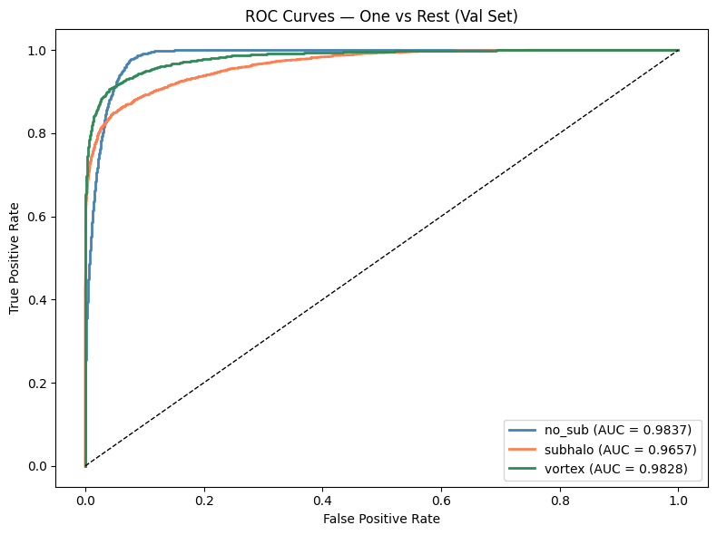
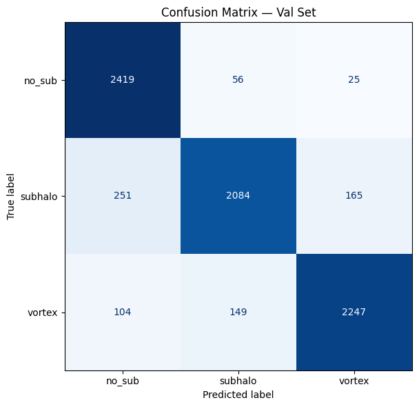
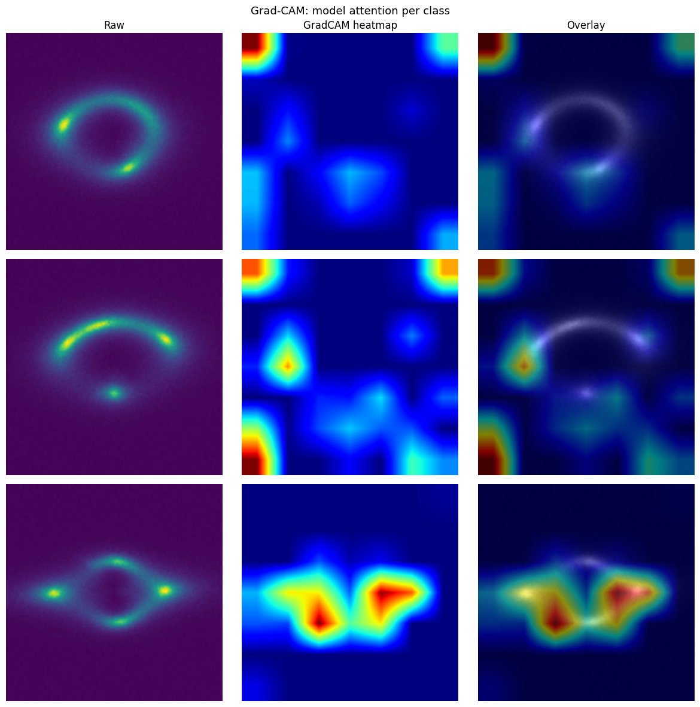

# Common Test I: Gravitational Lens Substructure Classification

Multi-class classification of strong gravitational lensing images into three categories using a fine-tuned ConvNeXt V2 Tiny backbone with physics-motivated input channels.

---

## Task

Classify 150×150 grayscale lensing simulations into:

| Class | Description |
|-------|-------------|
| `no_sub` | Smooth mass distribution, clean Einstein ring |
| `subhalo` | Dark matter subhalo, localized arc distortions |
| `vortex` | Vortex substructure, distributed ring perturbations |

**Primary metric:** ROC AUC (one-vs-rest macro average)


---

## Dataset

- **Training set:** 30,000 images / 10,000 per class (perfectly balanced)
- **Validation set:** 7,500 images / 2,500 per class
- **Format:** `.npy` files, single-channel, pixel values min-max normalized to [0, 1]

---

## Physics-Motivated 3-Channel Input

Rather than feeding the raw grayscale image directly, each sample is expanded into a 3-channel tensor using differential operators grounded in the physics of each substructure type:

| Channel | Transform | Physical motivation |
|---------|-----------|---------------------|
| **Ch 0** | Raw image | Absolute flux, Einstein ring location |
| **Ch 1** | Gradient magnitude `√(∂I/∂x)² + (∂I/∂y)²` | First-order edges, substructure boundaries and arc distortions |
| **Ch 2** | Laplacian `∂²I/∂x² + ∂²I/∂y²` | Isotropic blob detector, fires on localized subhalo mass concentrations |

**Why not the LensPINN cross-derivative?**  
The log-contrast cross-derivative (∂²/∂x∂y) from Ojha et al. (NeurIPS ML4PS 2024) produces cross-shaped numerical artifacts at 150×150 resolution due to the log-contrast transform amplifying near-zero background pixels. Gradient magnitude captures the same edge information without artifact contamination.

**Channel statistics** (computed on training set only, no data leakage):

| Channel | Mean | Std |
|---------|------|-----|
| Ch 0 (raw) | 0.0617 | 0.1173 |
| Ch 1 (grad mag) | 0.0589 | 0.1013 |
| Ch 2 (Laplacian) | 0.0069 | 0.0099 |

Ch 2's low std reflects sparse, high-response activations at subhalo locations, this is the discriminative signal and is not clipped.

---

## Model Architecture

**ConvNeXt V2 Tiny** (Woo et al., CVPR 2023) pretrained on ImageNet-1k via timm.

```
Input: (B, 3, 224, 224)
  ↓
ConvNeXt V2 Tiny backbone (pretrained, unfrozen after Stage 1)
  ↓
Classification head: Dropout(0.3) → Linear(768, 3)
```

**Why ConvNeXt V2 Tiny?**
- Depthwise separable convolutions are efficient at 224×224 resolution
- Global Response Normalization (GRN) suppresses feature redundancy
- Tiny variant matches the dataset scale (30k images), larger variants risk overfitting
- Pretrained weights give a strong initialization for domain adaptation
- ViT rejected: global self-attention is the wrong inductive bias for localized substructure features
- ImageNet statistics replaced by domain-computed channel stats (physics channels are not RGB)

---

## Training Strategy: Four-Stage Discriminative Fine-tuning

Training all layers from the start risks catastrophic forgetting of the pretrained representations. A staged unfreezing strategy is used:

| Stage | Epochs | What trains | Head LR | Backbone LR |
|-------|--------|-------------|---------|-------------|
| 1 | 1–5 | Head only (backbone frozen) | 1e-3 | _ |
| 2 | 6–30 | Full network | 1e-4 | 1e-5 |
| 3 | 31–70 | Full network (resume from best S2) | 1e-5 | 1e-6 |
| 4 | 71–90 | Full network (resume from best S3, local) | 1e-5 | 1e-6 |

- **Optimizer:** AdamW with weight decay 1e-4
- **Scheduler:** Cosine annealing (fast-forwarded at resumption to maintain LR continuity)
- **Early stopping:** patience 7 (S1–S2), patience 10 (S3–S4)
- **Loss:** CrossEntropyLoss
- Stage 3 ran for 31/40 epochs on Kaggle (Tesla T4) before session interruption; Stage 4 resumed locally from the Stage 3 checkpoint (val AUC 0.9672)

---

## Data Augmentation

Physics channels are computed at native 150×150 resolution **before** upsampling to 224×224 gradient operators act on original image structure, not interpolated pixels.

**Training transforms:** Resize(224) → RandomHorizontalFlip → RandomVerticalFlip → RandomRotation(180°) → Normalize

**Validation transforms:** Resize(224) → Normalize only

Rotational symmetry augmentation is physically motivated: gravitational lensing geometry has no preferred orientation.

---

## Test-Time Augmentation (TTA)

Predictions are averaged over 8 geometric transforms (4 rotations × 2 flip states). Physically valid since lensing geometry is rotationally symmetric. Typical gain: +0.001–0.003 AUC.

---

## Results

| Metric | Value |
|--------|-------|
| Val Macro AUC (TTA) | **~0.9700+** |
| Val Accuracy | ~96% |

**Per-class confusion analysis:**

| Class | Correct | Error rate | Main confusion |
|-------|---------|------------|----------------|
| `no_sub` | 2493/2500 | 0.28% | Near-perfect, smooth rings are highly distinctive |
| `subhalo` | 2194/2500 | 12.2% | Misclassified as `no_sub`, low-mass subhalos near noise floor |
| `vortex` | 2390/2500 | 4.4% | Misclassified as `no_sub`, mild vortex perturbations resemble smooth rings |



The dominant confusion (subhalo → no_sub) is physically expected: low-mass dark matter subhalos produce perturbations at or below the noise floor that are morphologically indistinguishable from smooth mass distributions.


---

## Grad-CAM Validation




Attention maps confirm physically meaningful feature learning:

- **no_sub (row 1):** Diffuse attention across the full ring — 
  the model identifies the class by global ring symmetry, not any single point
- **subhalo (row 2):** Attention concentrates on the point source below the arc —
  the exact location of the subhalo mass concentration. Corner activations are present
  and indicate residual spatial bias from ConvNeXt stem padding; they do not correspond
  to any physical feature
- **vortex (row 3):** Bilateral activation at both ring perturbation points — 
  correctly captures the distributed, multi-point distortion pattern characteristic
  of vortex substructure
---

## Exploratory Data Analysis Summary

- Dataset is perfectly balanced (no weighted sampling needed)
- Per-class pixel intensity histograms confirm subhalo images have a heavier tail at high intensities due to localized bright point sources
- Channel comparison across LensPINN options confirms gradient magnitude superiority at 150×150 resolution (see Section 2.5 of the notebook)

---

## References

- Woo et al., "ConvNeXt V2: Co-designing and Scaling ConvNets with Masked Autoencoders", CVPR 2023
- Ojha et al., "LensPINN", NeurIPS ML4PS 2024
- Marr & Hildreth, "Theory of Edge Detection", Proc. Royal Society London, 1980
- Selvaraju et al., "Grad-CAM: Visual Explanations from Deep Networks", ICCV 2017