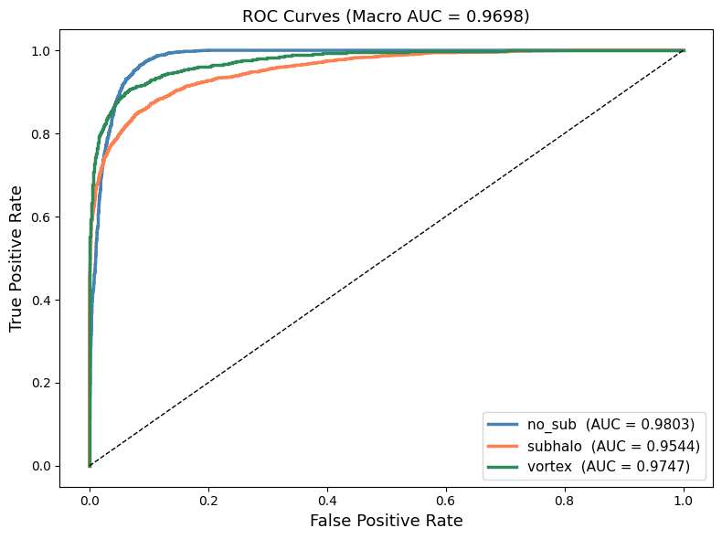
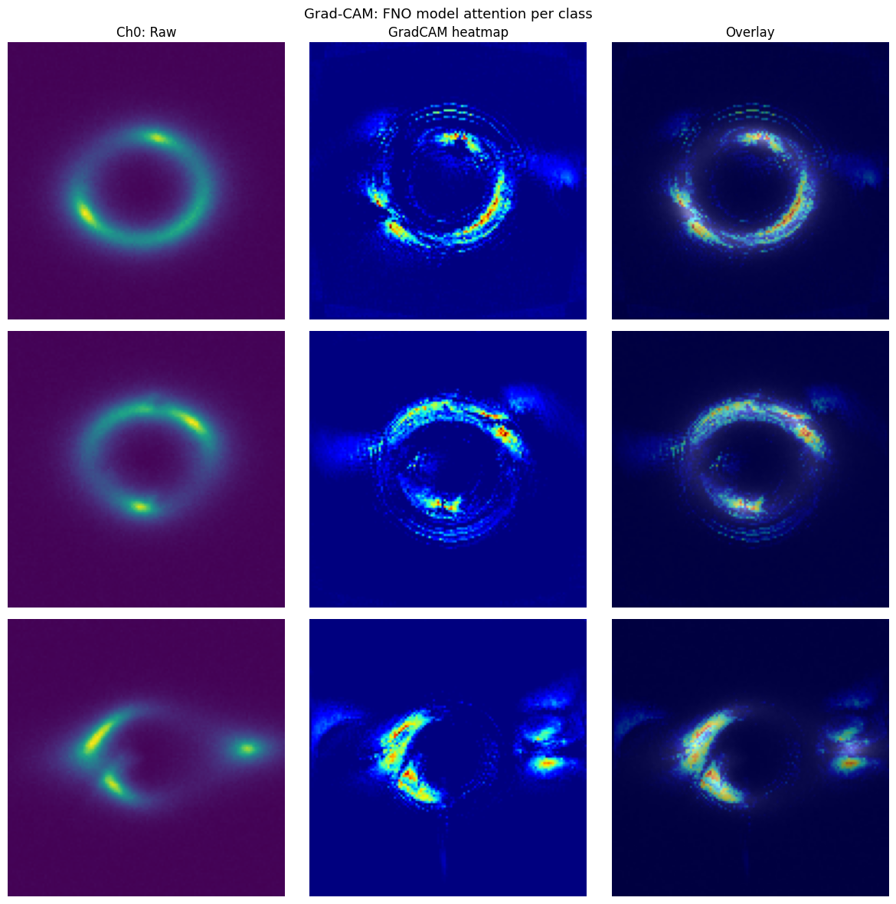

# Specific Test IV. Neural Operators

Neural Operator architecture for gravitational lens substructure classification, using a Fourier Neural Operator (FNO) backbone with polar-domain input channels, benchmarked against the ConvNeXt V2 result from Common Test I.

---

## Task

Build a classifier for the same 3-class lensing problem (`no_sub` / `subhalo` / `vortex`) using a **Fourier Neural Operator** as the backbone feature extractor instead of a standard CNN, and compare its performance against Common Test I.

---

## Why FNO for Lensing?

Standard CNNs apply learned convolutional filters locally in spatial coordinates. A Fourier Neural Operator instead learns in **frequency space** via spectral convolutions:

| Property | Standard CNN | Fourier Neural Operator |
|----------|-------------|------------------------|
| Receptive field | Local (kernel-bounded) | **Global** (entire image, one layer) |
| Operation domain | Spatial (pixel space) | Frequency (Fourier space) |
| Feature type | Local edges, textures | Global periodic / ring-like structures |
| Inductive bias | Translation equivariance | Spectral frequency selectivity |
| Parameter efficiency | O(k²·C²) per layer | O(modes·C²),  independent of image size |

The Einstein ring in lensing images is an inherently **global, ring-shaped structure**. A single FNO spectral convolution sees the entire ring at once, whereas a CNN needs many stacked layers to accumulate global context. This makes FNO a theoretically well-motivated architecture for lensing classification.

---

## How FNO Differs from Standard CNNs

In a standard convolutional layer:
```
output(x,y) = Σ_k kernel(k) * input(x+k, y+k)
```

In a SpectralConv2d (FNO layer):
```
1. FFT the input: X̂ = FFT2(input)
2. Multiply low-frequency modes by learned complex weights: Ŷ = X̂[:modes] * W_complex
3. IFFT back to spatial: output = IFFT2(Ŷ)
```

Each FNO block adds a 1×1 bypass convolution (identity-like residual) that preserves fine spatial detail not captured in the truncated frequency spectrum.

---

## Input Channel Design: 4-Channel Physics Representation

Standard CNN channels (gradient magnitude, Laplacian) are local features that do not map efficiently into the frequency domain. The FNO input uses **polar-domain and symmetry-breaking channels** that better exploit spectral convolutions:

| Ch | Name | Encoding | FNO benefit |
|----|------|----------|-------------|
| **0** | Raw (Cartesian) | Raw image flux | Baseline spatial view |
| **1** | Polar transform | Cartesian → Polar remapping | Einstein ring → horizontal stripe; substructure → vertical spike; FNO frequency modes now align with ring structure |
| **2** | Angular gradient `\|dI/dθ\|` | Per-pixel angular intensity change | Localizes substructure along the ring arc in polar space |
| **3** | Radial deviation `\|I − ring_mean\|` | Departure from radial symmetry | Directly encodes symmetry breaking, the defining signature of subhalos and vortices |

**Channel selection rationale (from ablation study):**

Channels eliminated during development:
- Log PSD (v1): Ch2 (phase) was uniform noise; underperformed
- Bandpass + azimuthal asymmetry (v3): Ch1 dominated by ringing artifacts; Ch2 produced identical concentric rings across all classes, zero discriminative signal
- Gradient + Laplacian (CNN baseline): Local features; Laplacian dominated by noise; FNO spectral convolutions do not benefit from local edge detectors

The final 4-channel set provides **informationally orthogonal signals** while mapping efficiently into the frequency domain.

**Augmentation pipeline (order matters for physical consistency):**
1. Geometric augmentation on raw only (flip / rotate / translate)
2. Compute Ch1–Ch3 from the augmented raw → channels are physically consistent with the augmented image
3. Normalize all 4 channels
4. RandomErasing on Ch0 only, never corrupts symmetry channels

---

## Model Architecture

```
Input: (B, 4, 150, 150)  ← 4-channel physics input
         │
   Lifting Conv2d(4 → 64) + InstanceNorm + GELU
         │
      ×4  FNOBlock2d
         │   SpectralConv2d  ← learns in Fourier frequency space (global receptive field)
         │ + Conv1×1 bypass  ← preserves fine spatial detail
         │   InstanceNorm + GELU
         │
   Projection Conv2d(64 → 128) + BN + GELU
         │
   AvgPool ‖ MaxPool  →  concat  →  (B, 256)
         │
   FC(256) → BN → GELU → Dropout(0.3) → FC(3)
```

**Key hyperparameters:**

| Parameter | Value | Rationale |
|-----------|-------|-----------|
| `width` | 64 | Feature channel count throughout FNO blocks |
| `modes` | 20 | 20/150 ≈ 13% of spectrum, targets the arc morphology frequency band |
| `depth` | 4 | Four spectral convolution blocks |
| `dropout` | 0.3 | Regularization in classification head |

**SpectralConv2d implementation:** Learns four real-valued weight tensors (wr1, wi1, wr2, wi2) representing complex weights for the low-frequency modes. Complex multiplication is performed explicitly to avoid numerical issues.

---

## Training

**Phase 1:** 80 epochs from scratch
- Optimizer: AdamW (lr=1e-3, weight_decay=1e-4)
- Scheduler: OneCycleLR
- Loss: CrossEntropyLoss with label smoothing 0.05
- Early stopping: patience 15

**Phase 2:** Resume from best checkpoint, 120 total epochs
- LR reduced 10× (1e-4) for fine-tuning
- Patience increased to 20
- Full network unfrozen throughout (FNO is trained from scratch, no pretrained weights)

**Note:** Unlike Common Test I (which used ImageNet pretrained weights), the FNO is trained entirely from the lensing dataset. This is both a limitation and a design choice: no pretrained FNO weights exist for this domain, and the architecture's global receptive field provides a strong inductive bias that partially compensates.

---

## Test-Time Augmentation (TTA)

Predictions averaged over 8 geometric transforms (4 rotations × 2 flip states). For each TTA view, Ch1–Ch3 are recomputed from the augmented raw image to maintain physical consistency.

A **per-class threshold grid search** was also performed over `[0.0, 0.75)` in steps of 0.05 to find thresholds that maximize validation accuracy beyond argmax decoding. If no class clears its threshold, argmax is used as fallback.

---

## Results & Comparison with Common Test I

| Model | Architecture | Val Macro AUC | Val Accuracy |
|-------|-------------|---------------|--------------|
| **Common Test I** | ConvNeXt V2 Tiny (pretrained, 3-ch) | 0.9819 | 91.17% |
| **Specific Test IV** | FNO2d from scratch (4-ch polar) | 0.9698 | 0.8759 |

| Task I ROC | Task IV ROC |
|------------|-------------|
|  |  |

**Key differences driving the performance gap:**

1. **Pretraining:** ConvNeXt V2 benefits from ImageNet-1k FCMAE pretraining, 1.2M images of rich visual features. FNO is initialized randomly and must learn everything from 30k lensing samples.

2. **Parameter count:** ConvNeXt V2 Tiny has ~28M parameters with a heavily regularized, proven architecture. The FNO classifier is smaller and trained without transfer learning.

3. **Inductive bias:** FNO's global spectral convolutions are theoretically better matched to ring-shaped structures, but the benefit requires the model to converge, which is harder without pretraining.

4. **Channel design:** The 4-channel polar representation is more tailored to FNO than the CNN channels, partially compensating for the lack of pretraining.

---

## Strategy Discussion

**Architecture choice: FNO over DeepONet**

FNO was selected over DeepONet for this classification task because:
- FNO naturally processes gridded 2D images without mesh parameterization
- SpectralConv2d is a drop-in replacement for Conv2d, straightforward to build a classification pipeline
- DeepONet is better suited to operator learning between function spaces with different discretizations, not the primary need here
- FNO's global receptive field is directly applicable to Einstein ring detection

**How FNO replaces the CNN feature extractor:**

In a standard CNN pipeline, convolutional layers build up spatial features through local kernels stacked to achieve increasing receptive fields. In the FNO pipeline, the SpectralConv2d layer immediately sees the entire image through the FFT, the 20 retained frequency modes correspond to the scale range of arc morphology features (roughly 7–75 pixel wavelengths). The 1×1 bypass convolution in each FNO block is the only local operation, preserving fine-grain spatial detail that the truncated spectrum discards.

## Grad-CAM Validation



The FNO attention maps reveal a qualitatively different feature extraction 
strategy compared to the ConvNeXt V2 baseline:

- **no_sub (row 1):** Attention distributes across the entire Einstein ring 
  simultaneously — the model assesses full ring geometry and symmetry in a 
  single global operation, consistent with FNO's unbounded receptive field
- **subhalo (row 2):** Ring-tracing attention with concentrated hot spots at 
  arc discontinuity locations — the model detects subhalo-induced breaks in 
  arc continuity by comparing the full ring globally
- **vortex (row 3):** High attention along the partial arc length and at the 
  isolated arc fragment — correctly identifies the broken, asymmetric ring 
  structure characteristic of vortex substructure

The concentric ripple pattern visible in all heatmaps is the expected spatial 
signature of Grad-CAM gradients backpropagated through the IFFT operation — 
it confirms gradients are correctly flowing through the spectral convolution 
pathway rather than bypassing it through the 1×1 residual branch.

Compared to the ConvNeXt baseline (which attends to local blobs and patches), 
the FNO attends to the ring as a continuous global structure, the architectural 
difference is made visually explicit in these maps.

---

## References

- Li et al., "Fourier Neural Operator for Parametric Partial Differential Equations", ICLR 2021
- Kovachki et al., "Neural Operator: Learning Maps Between Function Spaces", JMLR 2023
- Woo et al., "ConvNeXt V2: Co-designing and Scaling ConvNets with Masked Autoencoders", CVPR 2023
- Selvaraju et al., "Grad-CAM: Visual Explanations from Deep Networks", ICCV 2017